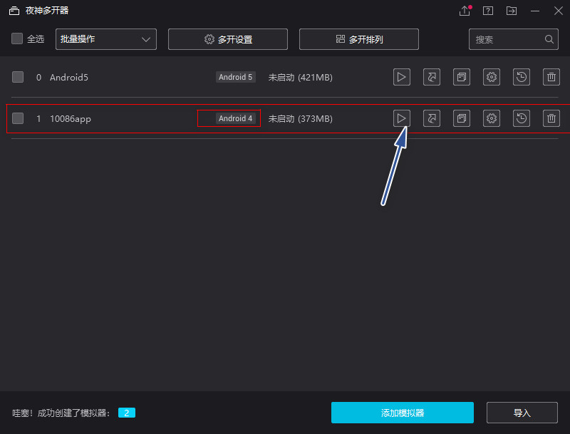
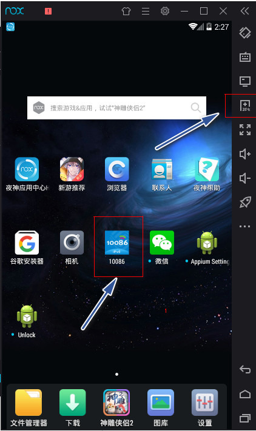
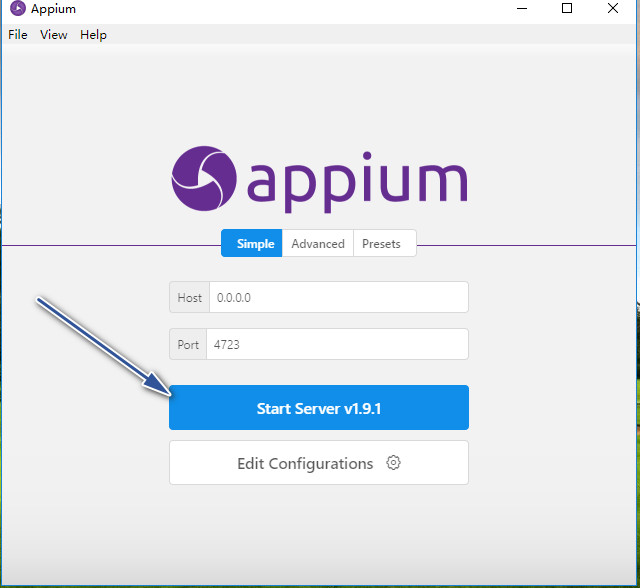
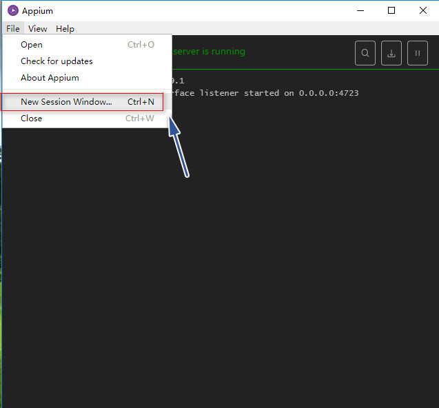
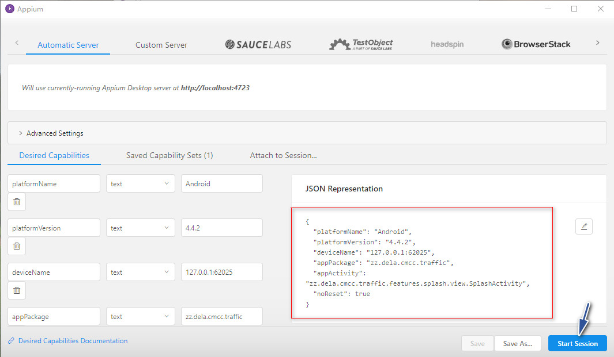
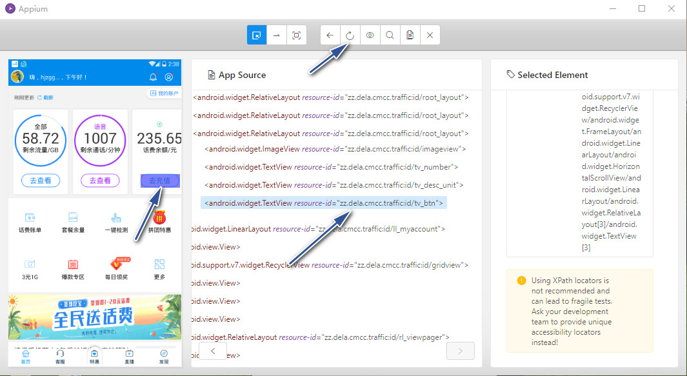
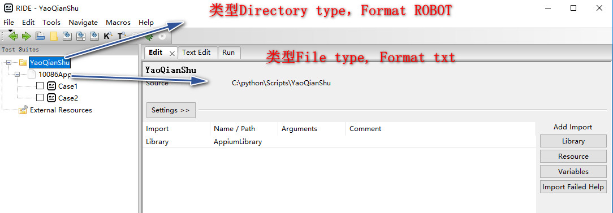
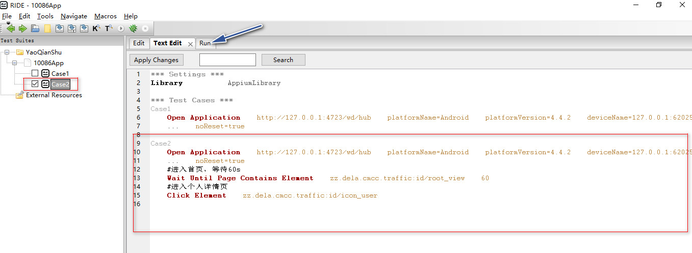
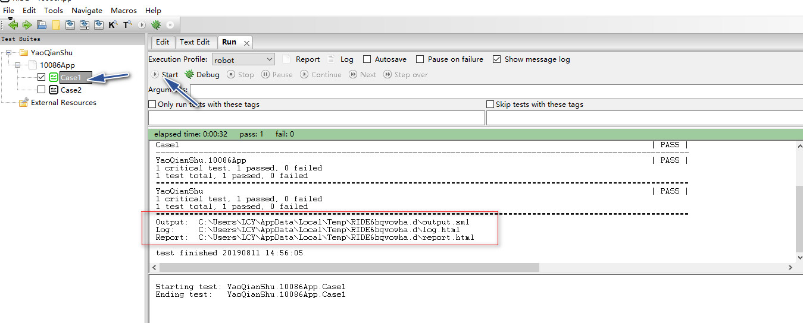
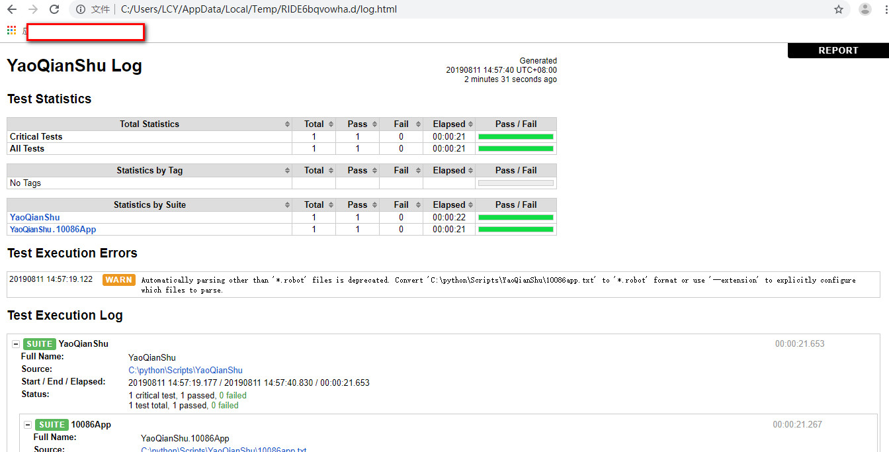

### Java + robotframework + seleniumlibrary
*   使用Robot Framework Maven Plugin（http://robotframework.org/MavenPlugin/）执行自动化测试
*   chromedriver下载： http://chromedriver.storage.googleapis.com/index.html
*   chromedriver和chrome版本对应关系：https://sites.google.com/a/chromium.org/chromedriver/downloads
*   chromedriver直接放到chrome所在目录
*   插件执行，需要指定chromedriver位置
```
robotframework:run "-Dwebdriver.chrome.driver=C:\Program Files (x86)\Google\Chrome\Application/chromedriver.exe"
```

### Java + robotframework + seleniumlibrary 二次开发
*   java to exe: http://launch4j.sourceforge.net/


### Python + robotframework + appiumlibrary + Appium
#### 1、安装python3.3+
#### 2、安装robotframework
*    pip install -i https://pypi.tuna.tsinghua.edu.cn/simple robotframework
#### 3、app测试，安装robotframework-appiumlibrary
*    pip install -i https://pypi.tuna.tsinghua.edu.cn/simple robotframework-appiumlibrary
#### 4、测试用例操作图形界面，安装robotframework-ride
*    pip install -i https://pypi.tuna.tsinghua.edu.cn/simple robotframework-ride
*    可创建快捷方式：ride.py
*    4.1 File-New Project，选择类型Directory type, 选择Format ROBOT
*    4.2 测试项目-New Suite，输入Name，选择类型File type，选择Format txt
*    4.3 测试套件-New Test Case，输入Name
*    4.4 导入测试库AppiumLibrary
*    4.5 编写测试用例
*    参考：https://www.cnblogs.com/tester-l/p/7994480.html
#### 5、web测试，安装robotframework-selenium2library
*    pip install -i https://pypi.tuna.tsinghua.edu.cn/simple robotframework-selenium2library
#### 6、安装Android SDK，Appium
*    https://www.cnblogs.com/feng0815/p/8179714.html
*    6.1 安装Android SDK，需要在模拟器上运行apk文件 （http://tools.android-studio.org/index.php/sdk/）
*    6.2 安装nodejs 官网(https://nodejs.org/en/download/)
*    6.3 安装Appium Desktop(http://pan.baidu.com/s/1jGvAISu)
*    File -> New Session Window  创建Appium客户端，方便元素定位
```json
    {
      "platformName": "Android",
      "platformVersion": "4.4.2",
      "deviceName": "127.0.0.1:62025",
      "appPackage": "zz.dela.cmcc.traffic",
      "appActivity": "zz.dela.cmcc.traffic.features.splash.view.SplashActivity",
      "noReset": true
    }
```
#### 7、安装夜神模拟器
*    启动模拟器
*    adb devices 如果没有发现设备信息，将SDK目录下的adb.exe文件，复制到夜神模拟器的目录下，复制过去之后改名为nox_adb.exe，然后重启
*    夜神模拟器设备信息为ip:port
*    参考：https://jingyan.baidu.com/article/1e5468f9bb6ab9484961b707.html
#### 8、获取apk信息
*    进入sdk\build-tools\版本号 的目录下，cmd命令：
*    ./aapt dump badging xxx.apk
*    可以看到：package: name='zz.dela.cmcc.traffic'
*    launchable-activity: name='zz.dela.cmcc.traffic.features.splash.view.SplashActivity'

#### 9、RIDE基本配置
*    https://www.cnblogs.com/lynn-li/p/6290268.html
```txt
   *** Test Cases 打开app应用***
    Case1
        Open Application    http://127.0.0.1:4723/wd/hub    platformName=Android    platformVersion=4.4.2    deviceName=127.0.0.1:62025    appPackage=zz.dela.cmcc.traffic    appActivity=zz.dela.cmcc.traffic.features.splash.view.SplashActivity      noReset=true
```
#### 10、操作流程
*   打开夜神多开器，创建模拟器，android版本为4，然后启动模拟器

*   安装10086app

*   打开Appium，默认配置即可，直接启动（启动的是Appium服务端）

*   创建Appium客户端，填写模拟器设备名称（通过adb devices命令查看），apk包信息等，然后启动客户端


*   Appium客户端可以帮忙定位app页面上的元素信息

*   开启RIDE，编写测试脚本


*   在RIDE执行Test Case，会生生测试报告




